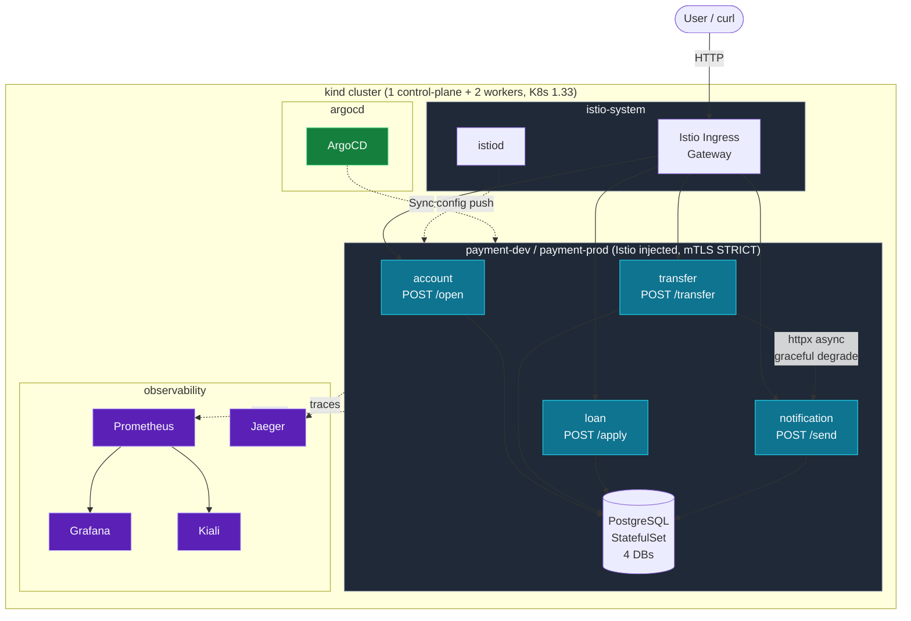
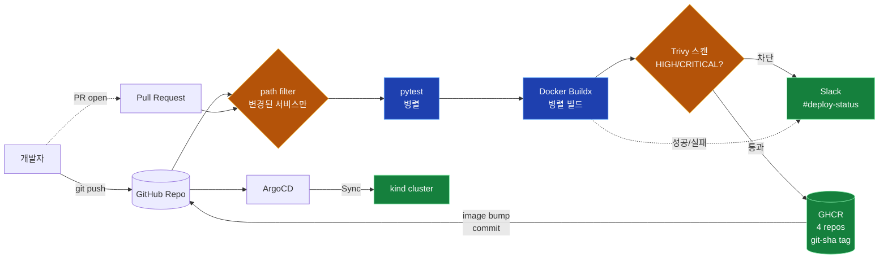

# Payment Platform — DevOps Portfolio

쿠버네티스 기반 핀테크 결제 플랫폼(계좌·이체·대출·알림 4개 마이크로서비스)을
**CI/CD · GitOps · 서비스 메시 · 관측 · 카오스 엔지니어링**까지 풀 스택으로 자동화한
DevOps 엔지니어 취업용 포트폴리오 프로젝트입니다.

> **본 프로젝트의 핵심은 애플리케이션이 아니라 그 위에서 동작하는 DevOps 산출물**입니다.
> 4개 서비스의 비즈니스 로직은 의도적으로 mock 수준으로 최소화하고,
> 운영 자동화·신뢰성·관측·복원력 시연에 집중합니다.

- **작업자**: 1명 / **기간**: 4일 / **인프라 비용**: 0원 (로컬 kind + GitHub 무료 + GHCR)
- **로컬 환경**: Ubuntu 24.04 (WSL2) on Windows 11, 16GB RAM
- **상세 요구사항 33개**: [`docs/requirements.md`](docs/requirements.md) (필수+선택 모두 필수로 승격)
- **백로그 62개**: [`docs/BACKLOG.md`](docs/BACKLOG.md) · **추적표**: [`docs/traceability-matrix.md`](docs/traceability-matrix.md)

---

## 목차

- [아키텍처](#아키텍처)
- [CI/CD 흐름](#cicd-흐름)
- [기술 스택 (2026-05 기준 stable)](#기술-스택-2026-05-기준-stable)
- [디렉토리 구조](#디렉토리-구조)
- [Quickstart](#quickstart)
- [진행 현황](#진행-현황)
- [문서 인덱스](#문서-인덱스)

---

## 아키텍처

런타임 토폴로지 — 로컬 **kind** 클러스터 1개에 모든 컴포넌트가 네임스페이스로 분리되어 배포됩니다.
`payment-dev` / `payment-prod` 만 Istio 사이드카가 자동 주입되며, 인프라 네임스페이스는 mesh 밖에 둡니다.



### 핵심 설계 포인트

| 영역 | 결정 | 근거 |
|---|---|---|
| 클러스터 | kind 멀티노드 (1 + 2) | 0원, Istio + 4 svc + 관측 스택 동시 구동 가능한 최소 토폴로지 |
| 메시 | Istio 1.29.2 (demo profile) | Linkerd 대비 트래픽 라우팅·관측 옵션 풍부. 비교는 [ADR 0003](docs/adr/0003-mesh-istio-vs-linkerd.md) |
| Postgres | 1개 인스턴스 + 4 DB | 메모리 절약, init.sql 로 DB 자동 분리 (같은 host, 다른 DB) |
| transfer→notification | `httpx.AsyncClient` + graceful degrade | Kiali 토폴로지에 의미 있는 엣지를 만들고, Circuit Breaker 시연의 표적이 됨 |
| 사이드카 주입 | `payment-*` 만 ON | `istio-system` / `observability` 같은 인프라는 mesh 밖에 두는 게 표준 |

---

## CI/CD 흐름



### 단계별 책임

| 단계 | 도구 | 산출물 |
|---|---|---|
| 변경 감지 | `dorny/paths-filter` | 4개 서비스 중 변경된 것만 후속 단계 진입 |
| 단위 테스트 | pytest 8.x | `services/*/tests/` (총 11 테스트, 4잡 매트릭스 병렬) |
| 빌드 | Docker Buildx (멀티스테이지, UID 1001 비루트) | `services/*/Dockerfile` |
| 보안 스캔 | Trivy v0.70.0 (action SHA-pin) | HIGH/CRITICAL CVE 발견 시 푸시 차단 + PR 코멘트 |
| 레지스트리 | GHCR (4 repo 분리, `git-sha` 태그) | `ghcr.io/<owner>/<service>:<sha>` |
| 알림 | Slack Incoming Webhook | `#deploy-status` 채널 |
| 배포 | ArgoCD GitOps + Helm | dev 자동 sync / prod 승인 강제 |

---

## 기술 스택 (2026-05 기준 stable)

| 영역 | 컴포넌트 | 버전 | 비고 |
|---|---|---|---|
| 클러스터 | kind / Kubernetes | v0.27.0 / v1.33 | 로컬 멀티노드 |
| 메시 | Istio | 1.29.2 | demo profile, mTLS STRICT |
| GitOps | ArgoCD (Helm chart) | 9.5.11 | dev auto-sync, prod 수동 |
| 관측 | kube-prometheus-stack / Kiali / Jaeger | 84.5.0 / v2.24.0 / 2.17.0 | OTel 기반 v2 |
| 보안 | Trivy CLI / trivy-action | v0.70.0 / 0.36.0 (SHA-pin) | 2026-03 공급망 사건 회피 |
| 패키징 | Helm | v3.20.x | v4 회피 |
| 앱 | Python / FastAPI / asyncpg | 3.13 / 0.136.1 / 0.30.x | 컨테이너 + 비동기 스택 |
| DB | PostgreSQL | 17.9-alpine | StatefulSet, 4 DB |
| Runner | GitHub Actions | `ubuntu-24.04` (명시 핀) | `ubuntu-latest` 드리프트 방지 |

전체 핀 결정 근거: [`docs/tech-stack-versions.md`](docs/tech-stack-versions.md)

---

## 디렉토리 구조

```
.
├── README.md                          # 본 문서
├── CLAUDE.md                          # AI 작업 시 준수할 지침 (응답 직전 자가 점검)
├── kind-config.yaml                   # 로컬 클러스터 토폴로지
├── scripts/
│   ├── bootstrap.sh                   # kind 클러스터 + 네임스페이스 부트스트랩
│   ├── chaos/                         # 카오스 시나리오 스크립트 (EPIC 8)
│   ├── rollback.sh                    # 자동 롤백 (EPIC 9, 5분 이내 복구)
│   └── switch-bluegreen.sh            # 블루-그린 전환 스크립트 (EPIC 6)
├── services/
│   ├── _template/                     # FastAPI 베이스 (4 서비스의 원본)
│   ├── account/                       # POST /open
│   ├── transfer/                      # POST /transfer (notification 호출)
│   ├── loan/                          # POST /apply
│   └── notification/                  # POST /send
│       └── tests/                     # pytest 단위 테스트
├── charts/payment-platform/           # Helm chart (umbrella)
│   └── templates/
│       └── postgres.yaml              # PG StatefulSet + 4 DB init
├── manifests/
│   └── namespaces.yaml                # 5 네임스페이스 (Istio 주입 라벨 포함)
├── argocd/                            # Application 매니페스트 (dev/prod)
├── istio/                             # VirtualService / DestinationRule / PeerAuthentication / NetworkPolicy
├── observability/                     # Prometheus / Grafana / Kiali / Jaeger
├── .github/workflows/                 # CI 파이프라인
└── docs/
    ├── requirements.md                # 진리의 원천 (33개 요구사항)
    ├── BACKLOG.md                     # 4일 × 62 태스크
    ├── traceability-matrix.md         # 요구사항 ↔ 태스크 ↔ 산출물 표
    ├── tech-stack-versions.md         # 13 컴포넌트 버전 핀 + 근거
    ├── adr/                           # Architecture Decision Records (3종)
    ├── runbook/                       # 운영 절차 (롤백 등)
    ├── analysis/                      # 병목 분석 리포트 (EPIC 7)
    ├── metrics/                       # CI 병렬화 효과 / 롤백 시간 측정
    └── setup/local-tools.md           # Ubuntu 24.04 도구 설치 가이드
```

---

## Quickstart

> 사전 조건: Ubuntu 24.04 (WSL2 가능), 16GB RAM, sudo 권한.

### 1. 로컬 도구 설치

복붙 가능한 명령으로 작성된 가이드를 따라 8개 도구를 설치합니다 (~30분):

```bash
# Docker, kind v0.27.0, kubectl 1.33, helm 3.20, istioctl 1.29.2, argocd CLI, yq, jq, stern
# 단계별 명령은 docs/setup/local-tools.md 참조
less docs/setup/local-tools.md
```

설치 검증:
```bash
docker --version && kind version && kubectl version --client | head -1 \
  && helm version --short && istioctl version --remote=false
```

### 2. 클러스터 + 네임스페이스 부트스트랩

```bash
./scripts/bootstrap.sh
```

성공 판정: 노드 3개(Ready), 네임스페이스 5개(`payment-dev`, `payment-prod`, `argocd`, `istio-system`, `observability`).

### 3. 서비스 단위 테스트

5개 서비스(_template + 4 services) 의 venv 를 보장하고 pytest 를 일괄 실행:

```bash
./scripts/test-all.sh
# 첫 실행은 venv 5개 + 의존성 설치로 1~2분, 이후에는 캐시되어 수 초.
```

특정 서비스만:

```bash
./scripts/test-all.sh transfer
```

기대 결과: `Result: 5 pass, 0 fail` (총 11 테스트 통과).

수동으로 한 서비스만 실행하고 싶다면:

```bash
cd services/transfer
python3 -m venv .venv
./.venv/bin/pip install -r requirements.txt
./.venv/bin/pytest
```

예상 출력:
```
tests/test_main.py::test_health_returns_ok PASSED
tests/test_main.py::test_transfer_action_skips_notification_when_url_unset PASSED
=== 2 passed in 0.4s ===
```

> `source .venv/bin/activate` 대신 venv 의 binary 를 직접 호출(`./.venv/bin/pytest`)한다.
> activate 는 PATH 만 바꾸므로 system 의 같은 이름 도구가 우선 잡힐 수 있고, 일부만 복붙하면 누락되는 함정이 있다.
> 직접 호출 방식은 venv 활성화 여부와 무관하게 항상 그 venv 만 사용한다.

### 4. 다음 단계

EPIC 2 이후의 배포·관측·카오스 단계는 [`docs/BACKLOG.md`](docs/BACKLOG.md) 의 진행 순서를 따릅니다.

---

## 진행 현황

총 **62 태스크 / 33 요구사항**.

| EPIC | 영역 | 진행 |
|---|---|---|
| 0 | 부트스트랩 / 버전 검증 / 도구 가이드 | ✅ 완료 (6/6) |
| 1 | 4 서비스 + Postgres + pytest | ✅ 완료 (5/5) |
| 2 | 컨테이너 이미지 + GHCR 정책 | 진행 예정 |
| 3 | CI 파이프라인 (path filter, Trivy, Slack) | 진행 예정 |
| 4 | Helm chart + HPA + Probes + RollingUpdate | 진행 예정 |
| 5 | ArgoCD GitOps + Environment Protection | 진행 예정 |
| 6 | Istio (Canary, Blue-Green, mTLS STRICT) | 진행 예정 |
| 7 | Prometheus/Grafana/Kiali/Jaeger + 병목 분석 | 진행 예정 |
| 8 | NetworkPolicy + Circuit Breaker + 카오스 3종 | 진행 예정 |
| 9 | ADR + Runbook + 자동 롤백 + 데모 | 진행 예정 |

상세 체크박스 / R-ID 매핑: [`docs/BACKLOG.md`](docs/BACKLOG.md)

---

## 문서 인덱스

| 문서 | 역할 |
|---|---|
| [`docs/requirements.md`](docs/requirements.md) | 33개 요구사항 (R-ID 부여, 진리의 원천) |
| [`docs/BACKLOG.md`](docs/BACKLOG.md) | 4일 × 62 태스크, R-ID 역참조 |
| [`docs/traceability-matrix.md`](docs/traceability-matrix.md) | 요구사항 ↔ 태스크 ↔ 산출물 양방향 추적표 |
| [`docs/tech-stack-versions.md`](docs/tech-stack-versions.md) | 13 컴포넌트 버전 핀 + 공식 출처 + 보안 이슈 노트 |
| [`docs/setup/local-tools.md`](docs/setup/local-tools.md) | Ubuntu 24.04 도구 설치 가이드 |
| [`docs/adr/`](docs/adr/) | ADR 3종 (CI 도구 / 레지스트리 / 메시) — 작성 예정 |
| [`docs/runbook/`](docs/runbook/) | 롤백 등 운영 Runbook — 작성 예정 |
| [`docs/analysis/`](docs/analysis/) | 병목 분석 리포트 — 작성 예정 |
| [`docs/troubleshooting/`](docs/troubleshooting/) | 운영 중 마주친 이슈와 해결 과정의 postmortem-lite 기록 |
| [`CLAUDE.md`](CLAUDE.md) | AI 보조(Claude Code) 작업 시 준수할 지침 |

---

## License

[MIT](LICENSE)
