# CI 병렬화 효과 측정 (R-B1-O1)

본 문서는 **요구사항 R-B1-O1** ("4개 서비스의 빌드 Job 을 병렬로 실행하여 전체 배포 시간을 단축하고 개선 수치를 측정한다") 의 측정 결과를 정리한다.

| | |
|---|---|
| 측정 대상 워크플로 | `.github/workflows/ci.yml` |
| Runner | `ubuntu-24.04` (GitHub-hosted) |
| 측정 시점 | 2026-05-04 |
| 매트릭스 크기 | 4 services (`account` / `transfer` / `loan` / `notification`) |
| Trigger | 두 종류 — 같은 코드(workflow 변경 fallback) |
| 비교 도구 | (1) 실측 parallel wallclock, (2) 실측 데이터로 추정한 serial |

---

## 1. 원본 데이터 — 두 run 의 잡별 실행 시간

| Job | Run #7 | Run #8 |
|---|---:|---:|
| Detect changed services | 6s | 6s |
| Test (account) | 20s | 24s |
| Test (transfer) | 20s | 16s |
| Test (loan) | 13s | 15s |
| Test (notification) | 26s | 16s |
| Build/Scan/Push (account) | 1m 9s | 1m 42s |
| Build/Scan/Push (transfer) | 1m 21s | 1m 20s |
| Build/Scan/Push (loan) | 1m 19s | 59s |
| Build/Scan/Push (notification) | 1m 14s | 1m 17s |
| Notify Slack | 4s | 4s |
| **GHA Usage 합계 (billable minutes)** | **6m 32s** | **6m 39s** |

> GHA UI 의 "Usage" 페이지에 표시되는 합계는 **모든 잡의 실행 시간을 단순 합산**한 값으로,
> 사용자에게 청구되는 분(billable) 기준이다. **사용자가 체감하는 wallclock** 은 잡 의존성 그래프상
> 가장 긴 경로(critical path) 의 합으로 별도 계산한다.

---

## 2. 잡 의존성 그래프

```
changes ──► (test_account, test_transfer, test_loan, test_notification)
                            │  (4개 동시 실행)
                            ▼
            (build_account, build_transfer, build_loan, build_notification)
                            │  (4개 동시 실행)
                            ▼
                       notify_slack
```

따라서 **wallclock = `changes` + max(test_*) + max(build_*) + `notify`**.

---

## 3. 실측 결과 — 병렬 vs (추정) 직렬

### Parallel (실측 wallclock)

| 단계 | Run #7 | Run #8 | 산출 방식 |
|---|---:|---:|---|
| changes | 6s | 6s | 단일 잡 |
| max(test_*) | 26s | 24s | `max(20, 20, 13, 26)` / `max(24, 16, 15, 16)` |
| max(build_*) | 1m 21s | 1m 42s | `max(69, 81, 79, 74)` / `max(102, 80, 59, 77)` |
| notify | 4s | 4s | 단일 잡 |
| **합계 (wallclock)** | **1m 57s** | **2m 16s** | 의존성 chain 합 |

### Serial (추정, 같은 데이터로 계산)

만약 4개 service 가 한 runner 에서 차례로 돌았다면:

| 단계 | Run #7 | Run #8 | 산출 방식 |
|---|---:|---:|---|
| changes | 6s | 6s | 단일 |
| sum(test_*) | 1m 19s | 1m 11s | `20+20+13+26` / `24+16+15+16` |
| sum(build_*) | 5m 3s | 5m 18s | `69+81+79+74` / `102+80+59+77` |
| notify | 4s | 4s | 단일 |
| **합계 (estimated serial)** | **6m 32s** | **6m 39s** | 단순 합 |

> 직렬 추정치는 매트릭스 잡의 per-runner 셋업 오버헤드(가상 머신 부팅, repo checkout, Docker buildx 셋업 등) 가
> 4번이 아닌 1번만 발생한다고 가정한 **하한 추정**이다. 실제 직렬 실행은 셋업 비용을 모두 합쳐
> 이보다 더 길 가능성이 있다 (그래서 병렬화의 실제 이득은 더 크다).
>
> **GHA Usage 합계(6m 32s / 6m 39s) 와 우연히 같음** — 이는 단순 합산이 곧 직렬 추정치의 합과 같기 때문이며,
> 우연이 아니라 공식이 같다. 즉 GHA 가 보고하는 billable 분은 본 측정에서의 직렬 추정치와 정확히 일치한다.

### 병렬화 이득

| 지표 | Run #7 | Run #8 |
|---|---:|---:|
| Serial estimate | 6m 32s = **392 s** | 6m 39s = **399 s** |
| Parallel wallclock | 1m 57s = **117 s** | 2m 16s = **136 s** |
| **단축 시간** | 4m 35s | 4m 23s |
| **단축률** | **70.2 %** | **65.9 %** |
| **속도 향상 (speedup)** | **3.35×** | **2.93×** |

→ **약 3 배의 wallclock 단축**. 매트릭스 크기(`N=4`) 의 이론적 상한 4× 에 가까워, 잡 간 셋업 오버헤드를 빼고 나면 거의 선형 스케일링.

---

## 4. Mermaid 시각화 (Run #7 기준)

```mermaid
gantt
    title CI Parallel Execution (Run #7)
    dateFormat ss
    axisFormat %S s

    section Stage 1
    changes :crit, c1, 0, 6s

    section Stage 2 (parallel)
    test (account)      :a1, after c1, 20s
    test (transfer)     :a2, after c1, 20s
    test (loan)         :a3, after c1, 13s
    test (notification) :crit, a4, after c1, 26s

    section Stage 3 (parallel)
    build (account)      :b1, after a4, 69s
    build (transfer)     :crit, b2, after a4, 81s
    build (loan)         :b3, after a4, 79s
    build (notification) :b4, after a4, 74s

    section Stage 4
    notify :crit, n1, after b2, 4s
```



`crit` 으로 표시된 잡들이 critical path (`changes` → `test_notification` → `build_transfer` → `notify`).
이 4 개 잡의 합이 wallclock = 117 s.

---

## 5. 측정 방법론

1. **데이터 출처**: 각 run 의 GitHub Actions UI → Run details → Usage 페이지의 "Run time" 표.
2. **잡별 시간의 의미**: 각 잡의 시작부터 종료까지 (queueing 제외, runner 활성화 후 실행 + cleanup 포함).
3. **wallclock 계산식**:
   ```
   wallclock = T(changes) + max{T(test_i) for i in services}
                          + max{T(build_i) for i in services}
                          + T(notify)
   ```
4. **serial estimate 계산식**:
   ```
   serial = T(changes) + Σ T(test_i) + Σ T(build_i) + T(notify)
   ```
5. **재측정 가능성**: 같은 데이터 출처에서 누구나 위 두 공식을 적용해 동일 수치 도출.

---

## 6. 한계와 후속 작업

### 한계
- **Serial 은 추정치**: 실제 직렬 실행을 한 번도 하지 않았으므로, 매트릭스 비활성화 후 측정한 진짜 직렬 wallclock 과는 다를 수 있다. 셋업 오버헤드가 4 배 발생하면 직렬 wallclock 이 7~8 분 이상으로 늘어 단축률이 더 커진다.
- **Cache 효과**: GHA cache (`type=gha,scope=<service>`) 가 활성화되어 두 run 모두 일부 layer 가 hit. 첫 run (캐시 없음) 의 수치는 더 클 수 있음.
- **Runner 차이**: GitHub-hosted runner 의 instance 사양이 run 마다 일정하지 않아 ±10% 변동 가능.

### 후속
- **(선택) 직렬 baseline 측정**: 워크플로 일시 변경(matrix 비활성화, `for service in ...` 직렬 루프) 후 1 회 실행 → 실측 직렬 wallclock 기록 → 본 표에 추가.
- **Cache 무효화 후 cold run 측정**: GHA cache 를 한 번 비우고 첫 run 의 cold-cache 수치를 측정 → 캐시 효과의 정량값 분리.
- **이미지 사이즈 최적화**: 이미지 layer 수와 사이즈 줄이면 build 시간이 더 단축. distroless / chiseled 베이스로 실험.

---

## 7. 결론 (포트폴리오 요약)

> **본 프로젝트의 CI 는 4 개 service 매트릭스 병렬 실행으로 wallclock 을 약 3 배 (65~70% 단축) 줄였다.**
> 같은 데이터에서 산출한 serial estimate 는 약 6m 30s, parallel wallclock 은 약 2m 0s.
> 이 비율은 매트릭스 크기 N=4 의 이론적 상한 4× 에 근접하며, 잡 간 셋업 오버헤드를 감안하면 거의 선형 스케일링.

---

## 참조

- 측정에 사용된 두 run:
  - Run #7: `fix(ci): swap trivy-action for official CLI image; sanitize Slack pay…`
  - Run #8: `Merge pull request #21 from melanieing/claude/kubernetes-cicd-setup-y…`
- 워크플로 정의: [`.github/workflows/ci.yml`](../../.github/workflows/ci.yml)
- 요구사항: [`docs/requirements.md` R-B1-O1](../requirements.md)
